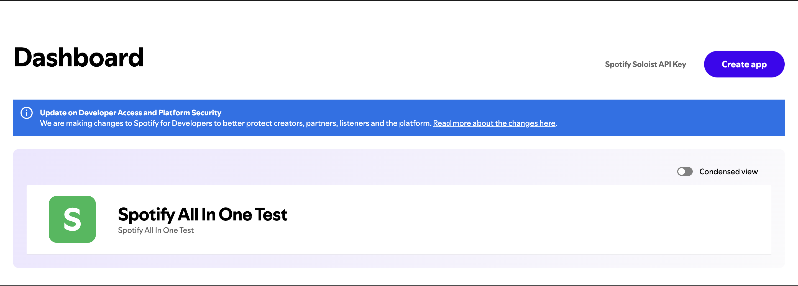
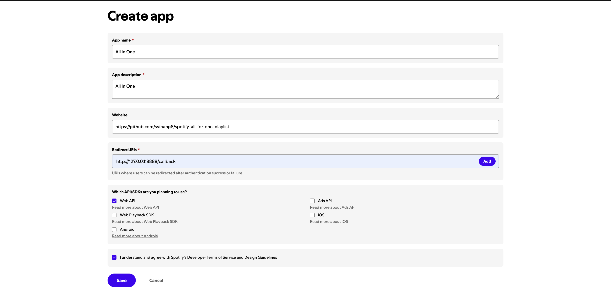
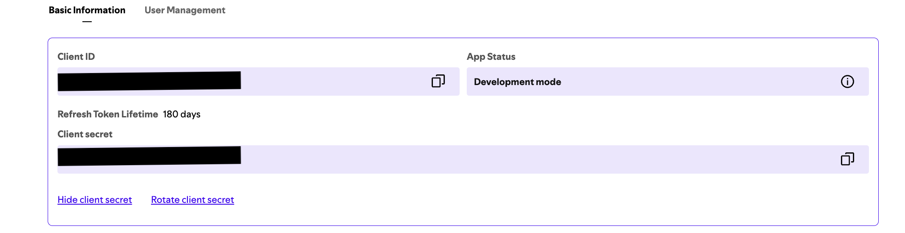
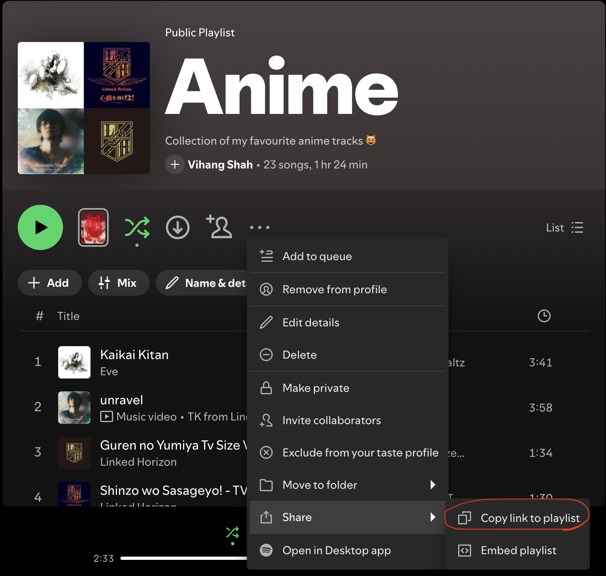

# spotify-all-for-one-playlist

[](https://buymeacoffee.com/svihang8)

Got several Spotify playlists you keep adding songs to, and wish there was
one single playlist that always had everything from all of them in one
place? This does that automatically, once a day, forever — no more manually
copying tracks between playlists.

Daily cron job that mirrors one Spotify playlist from the union of several
source playlists. Add/remove a track in any source playlist, and it gets
added/removed from the target playlist on the next run.

## How it works

Every run:

1. Reads `target_playlist_id` and `source_playlist_ids` from `config.yaml`.
2. Fetches all track URIs from each source playlist and unions them.
3. Fetches the target playlist's current track URIs.
4. Diffs the two sets and adds/removes tracks on the target playlist so it
   exactly matches the union of sources — a full mirror, not additive-only.

This runs as a GitHub Actions workflow on a daily schedule, or on demand via
"Run workflow" in the Actions tab.

## Setup

### 1. Use this template

Click **Use this template** on GitHub (top of the repo page), or fork it.

### 2. Create a Spotify app

1. Go to the [Spotify Developer Dashboard](https://developer.spotify.com/dashboard)
   and log in.
2. Click **Create app**.

   

3. Give it any name/description.
4. **Redirect URI**: enter exactly `http://127.0.0.1:8888/callback`. This
   must match exactly or the local authorization step below will fail.

   

5. Under "Which API/SDKs are you planning to use?", check **Web API**.
6. Agree to the terms and click **Save**.
7. Open the app, go to **Settings**, and copy the **Client ID**. Click
   **View client secret** to reveal and copy the **Client secret**.

   

### 3. Get a refresh token

This is a one-time manual step, run locally:

```
git clone <your-fork-url>
cd spotify-all-for-one-playlist
cp .env.example .env
```

Fill in `SPOTIFY_CLIENT_ID` and `SPOTIFY_CLIENT_SECRET` in `.env` (leave
`SPOTIFY_REFRESH_TOKEN` blank), then:

```
set -a; source .env; set +a
uv run python -m scripts.authorize
```

This opens your browser for a one-time Spotify login/consent. After you
approve, it prints a refresh token to the terminal — copy it.

> **Refresh tokens expire after ~180 days.** When that happens the daily
> cron run starts failing on auth. Fix: repeat this step to get a new
> refresh token, then update the `SPOTIFY_REFRESH_TOKEN` secret (step 4).
> Client ID/secret and `config.yaml` don't need to change.

### 4. Add GitHub Actions secrets

In your repo: **Settings → Secrets and variables → Actions → New repository
secret**. Add all three:

- `SPOTIFY_CLIENT_ID`
- `SPOTIFY_CLIENT_SECRET`
- `SPOTIFY_REFRESH_TOKEN` (from step 3)

### 5. Configure playlists

```
cp config.example.yaml config.yaml
```

Fill in your playlist IDs. The ID is the part of a playlist's share link
between `/playlist/` and any `?si=...`:

```
https://open.spotify.com/playlist/37i9dQZF1DXcBWIGoYBM5M?si=...
                                   ^^^^^^^^^^^^^^^^^^^^^^ this part
```

In the Spotify app: open the playlist → **⋯** → **Share** → **Copy link to
playlist**.



```yaml
target_playlist_id: "TARGET_PLAYLIST_ID"
source_playlist_ids:
  - "SOURCE_PLAYLIST_ID_A"
  - "SOURCE_PLAYLIST_ID_B"
```

Commit `config.yaml` — it's just playlist IDs, not secret.

### 6. Push

Push to GitHub. The workflow runs daily automatically (`0 6 * * *` UTC), or
trigger it manually any time from the **Actions** tab → **Sync playlist** →
**Run workflow**.

## Running locally

```
set -a; source .env; set +a
uv run python -m scripts.sync --config config.yaml
```

Note the `-m scripts.sync` form — running `scripts/sync.py` directly as a
file path breaks the package-relative imports.

## Tests

```
uv run pytest -q
```

If this saved you some manual playlist copying, you can
[buy me a coffee](https://buymeacoffee.com/svihang8). Entirely optional.

## License

MIT — see [LICENSE](LICENSE).
